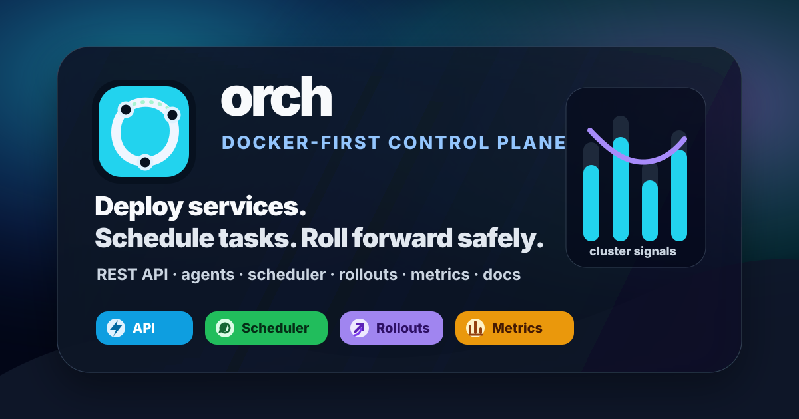
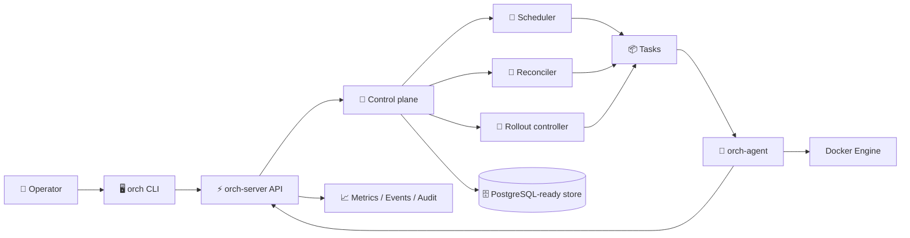
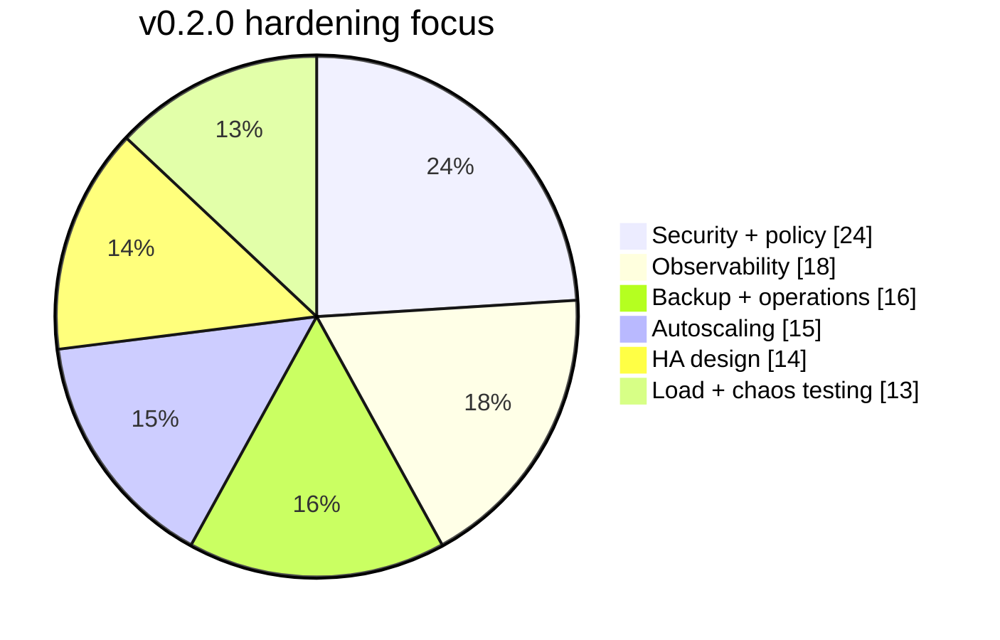

<p align="center">
  
</p>

<p align="center">
  <strong>Docker-first orchestration for small clusters — API, agents, scheduling, rollouts, observability, and production-shaped docs.</strong>
</p>

<p align="center">
  <a href="https://github.com/alekpopovic/orch/actions/workflows/ci.yml"></a>
  <a href="https://github.com/alekpopovic/orch/actions/workflows/pages.yml"></a>
  
  
  
</p>

<p align="center">
  <a href="docs/GITHUB_PAGES.md">📚 Docs site</a> ·
  <a href="docs/API.md">🔌 API</a> ·
  <a href="docs/PRODUCTION_DEPLOYMENT.md">🚢 Deploy</a> ·
  <a href="docs/SECURITY.md">🛡️ Security</a> ·
  <a href="api/openapi.yaml">🧾 OpenAPI</a>
</p>

<p align="center">
  
</p>

## ✨ Why orch

`orch` is a Go container orchestrator for small, Docker-based clusters. It gives operators a control-plane API, a worker agent, and a CLI for deploying services, scaling replicas, assigning tasks to nodes, running Docker containers, checking health, streaming logs, recording events, and coordinating rollouts.

The project is still MVP-era, but intentionally production-shaped: package boundaries, tests, migrations, metrics, docs, interfaces, and runtime seams are designed so the Docker-first core can evolve toward durable multi-node operation.

| Capability | What you get |
| --- | --- |
| ⚡ **Control plane** | REST API with request IDs, stable JSON errors, auth/RBAC boundaries, and OpenAPI docs. |
| 🧭 **Deterministic scheduling** | Scheduler and reconciler logic that stays testable without Docker, PostgreSQL, or real time. |
| 🐳 **Docker runtime** | Idempotent container operations through the Docker Engine API with orch labels and safe convergence. |
| 🚀 **Rollouts** | Rolling update and rollback coordination with service versions, deployment objects, and events. |
| 📈 **Observability** | Prometheus metrics, Grafana dashboard, structured logs, events, audit logs, and load/chaos testing docs. |
| 🛡️ **Hardening** | Security contexts, secret redaction, SSRF-safe healthchecks, registry credentials, and policy hooks. |

## 🧬 System map



## 📊 Release signal



## 🚀 Quickstart

Prerequisites:

- Go 1.25 or newer.
- Docker Engine and permission to access `/var/run/docker.sock`.
- Docker Compose v2.
- Bash, `curl`, and standard Unix shell tools.

Start PostgreSQL, `orch-server`, and one `orch-agent`:

```sh
./scripts/dev-up.sh
```

Apply migrations:

```sh
./scripts/migrate-up.sh
```

Point the CLI at the server:

```sh
export ORCH_SERVER_URL=http://localhost:8080
go run ./cmd/orch node ls
```

Deploy and operate the demo service:

```sh
./scripts/demo-deploy.sh
go run ./cmd/orch service ls
go run ./cmd/orch service ps http-api
go run ./cmd/orch scale http-api --replicas 2
go run ./cmd/orch rollout http-api --image nginx:1.28-alpine
go run ./cmd/orch events --service http-api
go run ./cmd/orch logs http-api --tail 100
go run ./cmd/orch delete http-api
```

Stop local services:

```sh
./scripts/dev-down.sh
```

## 🧰 Binaries

| Binary | Role |
| --- | --- |
| `orch-server` | REST API server and rollout controller. |
| `orch-agent` | Worker node process that talks to Docker and the server. |
| `orch` | Cobra CLI for operators and automation scripts. |
| `orch-loadtest` | Fake multi-agent load test runner for scheduler/control-plane pressure. |

## 🔌 Go API client

The public REST contract lives in `api/openapi.yaml`. Go programs can use the hand-written client in `pkg/client`:

```go
apiClient, err := client.New("http://localhost:8080", client.WithBearerToken(token))
if err != nil {
    return err
}
services, err := apiClient.ListServices(context.Background())
if err != nil {
    return err
}
fmt.Println(len(services))
```

## 🧪 Build and test

```sh
make build
make test
make lint
```

`make lint` requires `golangci-lint` on your `PATH`.

Useful direct commands:

```sh
go test ./...
go vet ./...
go build ./...
```

## ⚙️ CLI configuration

The CLI resolves the server URL in this order:

1. `--server`
2. `ORCH_SERVER_URL`
3. `server_url` in `~/.config/orch/config.yaml`

Example:

```yaml
server_url: http://localhost:8080
```

Output formats:

```sh
orch service ls --output table
orch service inspect api --output json
```

Example deploy file:

```yaml
name: api
image: ghcr.io/example/api:1.0.0
replicas: 3
ports:
  - container: 8080
    public: 80
env:
  NODE_ENV: production
resources:
  cpu: 500m
  memory: 512Mi
healthcheck:
  type: http
  path: /health
  interval: 10s
  timeout: 2s
restart:
  policy: always
placement:
  labels:
    role: app
```

## 🧱 Current boundaries

| ✅ Works today | 🚧 Still future work |
| --- | --- |
| In-memory control plane for local dev and tests. | Default server runtime is not yet PostgreSQL-backed. |
| PostgreSQL migrations and store implementation. | Restart-safe production server state wiring. |
| Agent registration, heartbeat, task polling, and Docker reconciliation. | mTLS node identity. |
| Scheduler, reconciler, rollouts, logs, events, metrics, auth, and CLI. | Overlay networking and containerd runtime support. |
| Security context policy, registry credentials, secret references, audit logs. | Full multi-tenant isolation model. |

## 📚 Documentation

| Area | Docs |
| --- | --- |
| 🌈 Brand + site | [GitHub Pages documentation site](docs/GITHUB_PAGES.md), [Brand kit](docs/BRAND.md), [Charts](docs/CHARTS.md) |
| 🏗️ Architecture | [Architecture](docs/ARCHITECTURE.md), [State machines](docs/STATE_MACHINES.md) |
| 🔌 API | [API](docs/API.md), [OpenAPI](api/openapi.yaml) |
| 🐳 Runtime | [Agent](docs/AGENT.md), [Service spec](docs/SERVICE_SPEC.md), [Resources](docs/RESOURCES.md) |
| 🧭 Control loops | [Scheduler](docs/SCHEDULER.md), [Reconciler](docs/RECONCILER.md), [Rollouts](docs/ROLLOUTS.md) |
| 🛡️ Security | [Security](docs/SECURITY.md), [Security review](docs/SECURITY_REVIEW.md), [Secrets](docs/SECRETS.md), [Registries](docs/REGISTRIES.md) |
| 📈 Operations | [Observability](docs/OBSERVABILITY.md), [Reliability](docs/RELIABILITY.md), [Operations](docs/OPERATIONS.md), [Production deployment](docs/PRODUCTION_DEPLOYMENT.md) |
| 🧪 Testing | [Load testing](docs/LOAD_TESTING.md), [Chaos testing](docs/CHAOS_TESTING.md), [Development](docs/DEVELOPMENT.md) |
