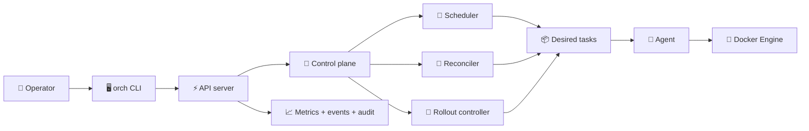
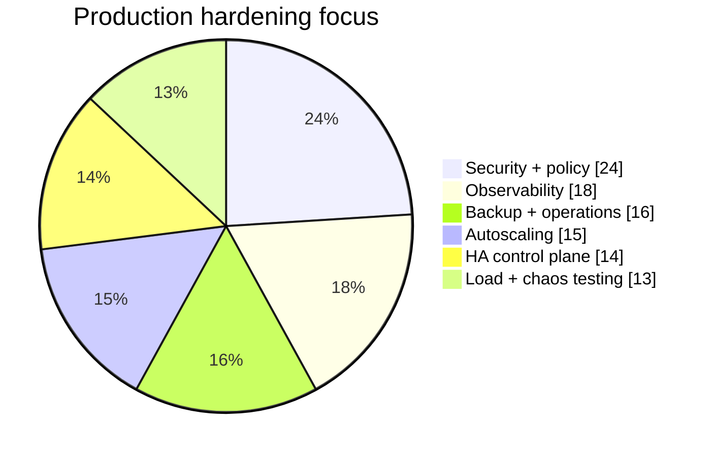
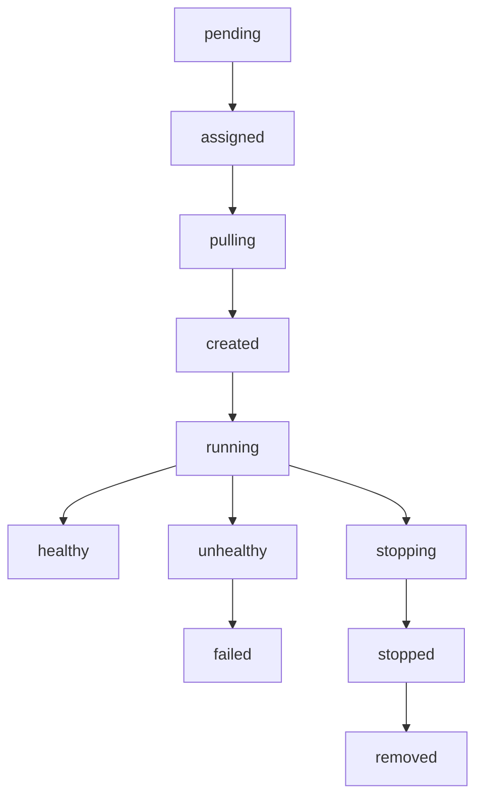
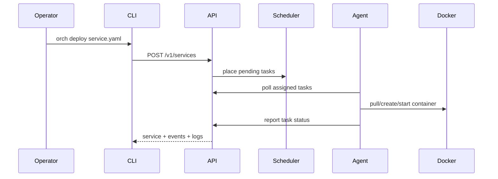

# Charts

The docs site renders Mermaid charts directly from Markdown. This keeps diagrams reviewable in pull requests and versioned with the release notes.

## Control Plane Flow

## v0.2.0 Release Mix

## Runtime Status Funnel

## Operator Feedback Loop

